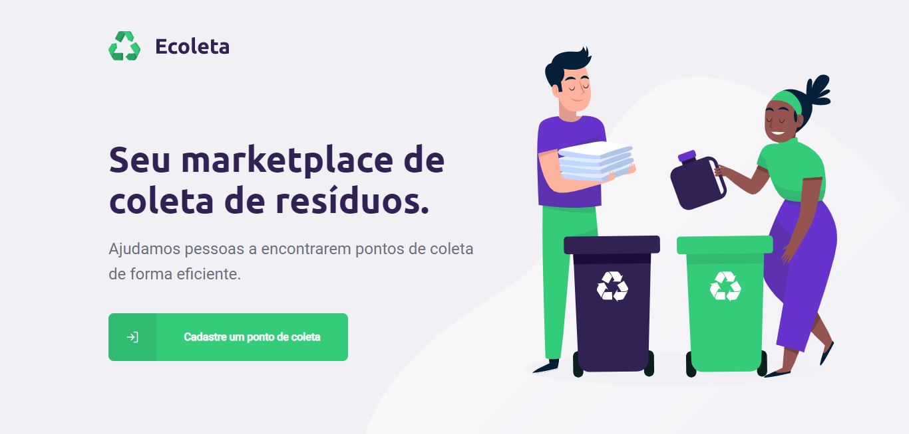
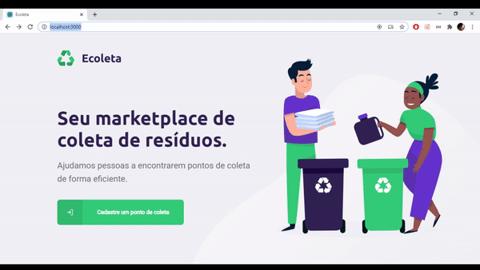
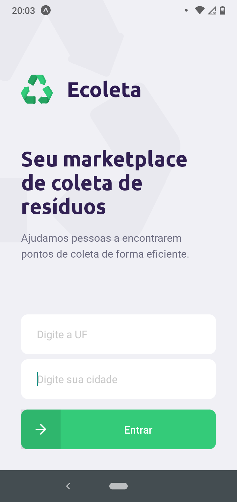
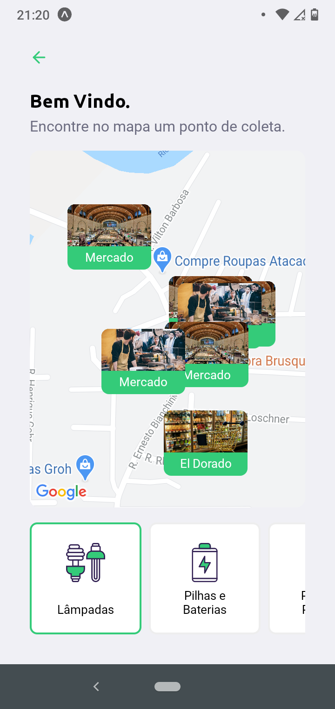
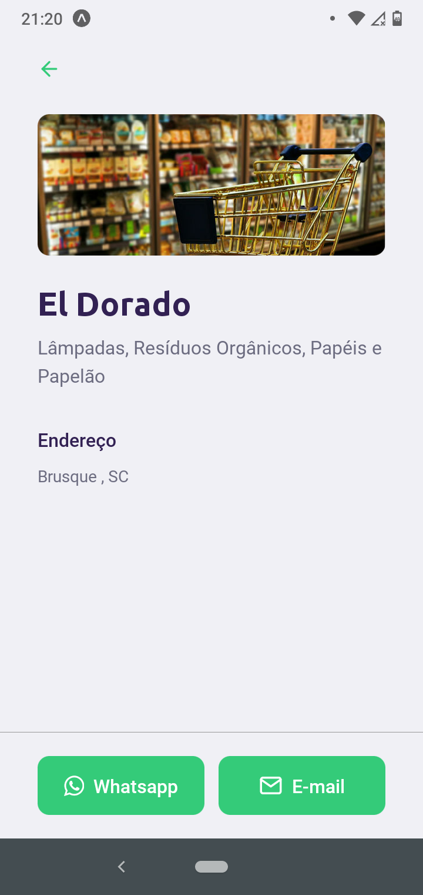

<div align="center">
  
</div>

# Índice

- [Sobre o Projeto](#sobre)
- [Tecnologias Utilizadas](#tecnologias-utilizadas)
- [Versão Web](#versao-web)
- [Versão Mobile](#versao-mobile)
- [Como Usar a Aplicação](#como-usar)

<a id="sobre"/>

# 📖 Sobre o Projeto

O **Ecoleta** é uma aplicação Web e Mobile que visa ajudar pessoas a encontrarem pontos de coleta de lixo.

Esta aplicação foi desenvolvida durante a **primeira** edição da semana **Next Level Week** da [Rocketseat](https://rocketseat.com.br/).

<a id="tecnologias-utilizadas"/>

# ⚙ Tecnologias Utilizadas

As seguintes tecnologias foram utilizadas para a construção deste projeto:
- [ReactJS](https://reactjs.org/)
- [React Native](https://reactnative.dev/)
- [Node.js](https://nodejs.org/en/)
- [TypeScript](https://www.typescriptlang.org/)
- [Knex](http://knexjs.org/)

<a id="versao-web"/>

# 💻 Versão Web

<div align="center">
  <h3>Resultado da aplicação Web.</h3>
  
  
</div>

<a id="versao-mobile"/>

# 📱 Versão Mobile

<div align="center" flexDirection="row">
 <h3>Resultado da aplicação Mobile</h3>
 
 
 
</div>

<a id="como-usar"/>

# ❓ Como Usar a Aplicação

### Observação:
Para mexer nesta aplicação voce necessita ter algumas ferramentas instaladas no seu computador e celular, abra este 
[guia](https://www.notion.so/Configurando-Ambiente-NLW-98a471ad3cb6448284b8ceed31c45767), leia com atenção e siga as intruções, é simples, não precisa ter medo 😉.

### → Passo um: Clonando o Projeto na sua máquina:
Abra seu terminal, escolha um lugar para guardar o repositório e execute:
```sh
  git clone https://github.com/MarcosJBM/Ecoleta-NLW.git
```
Com isso o repositório já estará na sua maquina.

### → Passo dois: Configurando o Projeto:
Nas pastas **Server** e **Web** execute:
```sh
 npm install
```
Com isso, dependências do projeto serão instaladas.

Na pasta **Server** voce irá precisar criar o **banco de dados**, execute:
```sh
 npx knex migrate:up "nome da migration"
```
Faça isso com cada Migration.

Voce irá precisar criar uma Seed, execute:
```sh
 npm run knex:seed
```

### → Passo três: Executando a aplicação.
Para executar a aplicação **Web** e **Mobile** utilize:
```sh
 npm start
```
Para executar o **Server**, utilize:
```sh
 npm run dev
```
