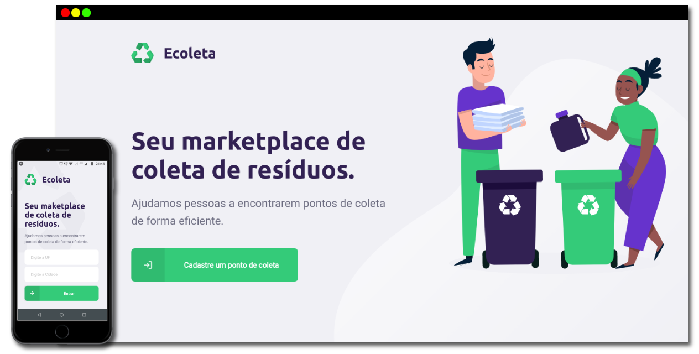

  

# 📖 About

**Ecoleta** is a web and mobile application that helps people register and find garbage collection points.

Project developed during **Next Level Week 1**, by [Rocketseat](https://rocketseat.com.br/).

# 🎨 Design

The application design is available on [Figma](https://www.figma.com/), if you are interested, click [here](<https://www.figma.com/file/9TlOcj6l7D05fZhU12xWT3/Ecoleta-(Booster)?node-id=0%3A1>).

# 🔩 Technologies

- [React](https://react.dev/)
- [React Native](https://reactnative.dev/)
- [Expo](https://expo.dev/)
- [Styled Components](https://styled-components.com/)
- [Node.js](https://nodejs.org/en/)
- [Axios](https://axios-http.com/)
- [Express](https://expressjs.com/pt-br/)
- [Knex.js](https://knexjs.org/)
- [Leaflet](https://leafletjs.com/)
- [TypeScript](https://www.typescriptlang.org/)
